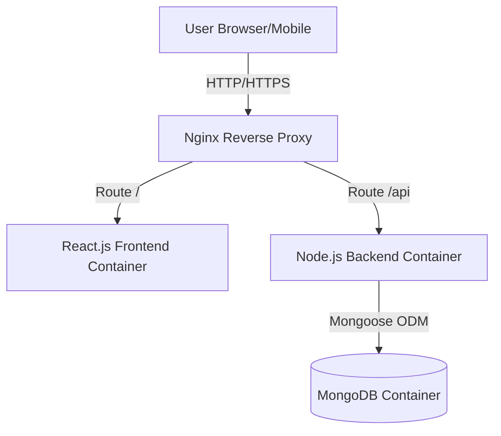

# Project Architecture: Online Quiz Platform

This document outlines the architecture, database design, and folder structure for the Online Quiz Platform.

## 1. System Architecture overview

The application follows a modern full-stack decoupled architecture.

- **Frontend:** React.js (Vite) with Tailwind CSS for styling and Framer Motion for animations.
- **Backend:** Node.js with Express.js for REST API development.
- **Database:** MongoDB for flexible, schema-less document storage.
- **Reverse Proxy:** Nginx routes incoming traffic to the appropriate service (Frontend or Backend).
- **Containerization:** Docker & Docker Compose ensure consistency across development and production environments.
- **CI/CD:** GitHub Actions automates testing and deployment to AWS EC2.



## 2. Database Design (MongoDB)

### Collections and Schema Outline

1. **Users Collection**
   - `_id`, `username`, `email`, `passwordHash`, `role` (user/admin), `createdAt`

2. **Quizzes Collection**
   - `_id`, `title`, `description`, `category`, `difficulty` (Easy/Medium/Hard), `timeLimitMinutes`, `isPublished`, `createdBy`

3. **Questions Collection** (Embedded in Quiz or separate, based on scale)
   - `_id`, `quizId`, `text`, `options` (Array of Strings), `correctOptionIndex`

4. **QuizAttempts Collection**
   - `_id`, `quizId`, `userId`, `score`, `accuracy`, `timeTaken`, `completedAt`

5. **Leaderboards Collection**
   - `_id`, `quizId`, `rankings` (Array of objects containing `userId`, `score`)

## 3. Folder Structure

```text
online-quiz-platform/
├── backend/                  # Node.js + Express API
│   ├── config/               # Environment and DB config
│   ├── controllers/          # Request handlers
│   ├── middlewares/          # Custom Express middlewares (Auth, Error)
│   ├── models/               # Mongoose schemas
│   ├── routes/               # Express routes
│   ├── tests/                # Jest & Supertest test cases
│   ├── server.js             # Entry point
│   ├── package.json
│   └── Dockerfile            # Backend multi-stage build
├── frontend/                 # React.js Application
│   ├── src/
│   │   ├── components/       # Reusable UI components
│   │   ├── pages/            # Route-level components
│   │   ├── services/         # Axios API calls
│   │   ├── utils/            # Helper functions
│   │   ├── App.jsx           # Main React component
│   │   └── index.css         # Tailwind directives
│   ├── tailwind.config.js    # Tailwind setup
│   ├── package.json
│   └── Dockerfile            # Frontend build and Nginx serving
├── nginx/                    # Reverse Proxy Config
│   └── default.conf          # Nginx routing logic
├── .github/workflows/        # CI/CD Pipeline
│   └── ci-cd.yml             # GitHub Actions definitions
├── docker-compose.yml        # Development orchestration
├── docker-compose.prod.yml   # Production orchestration
├── ARCHITECTURE.md           # This file
├── DEPLOYMENT_GUIDE.md       # EC2 Deployment Steps
├── CI_CD_PIPELINE.md         # Actions documentation
└── README.md                 # Main project overview
```
